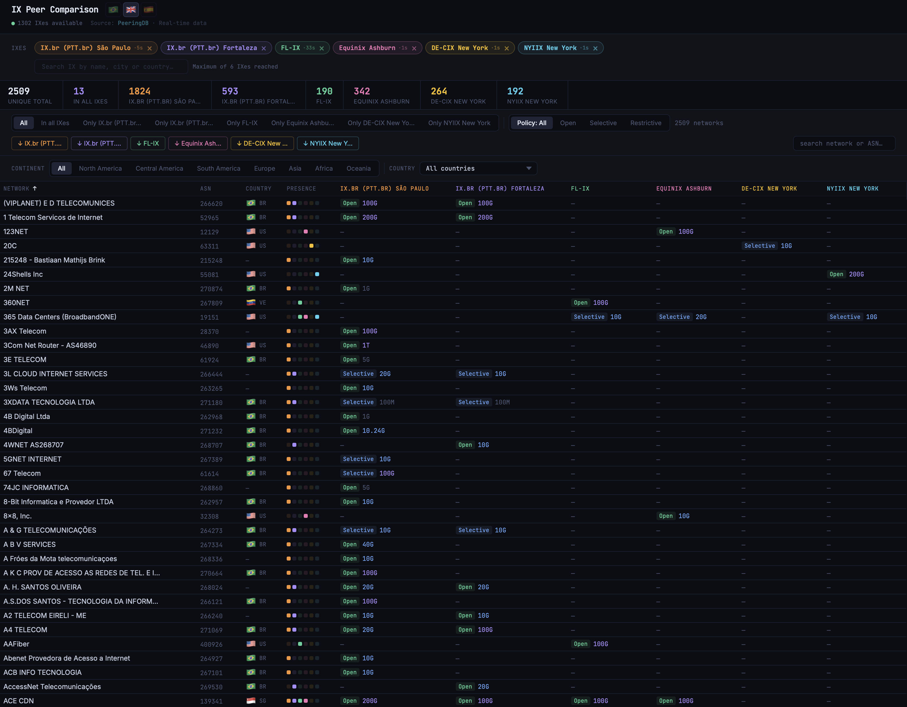

# IX Peer Comparison

A browser-based tool for visual comparison of peers across Internet Exchanges, powered by real-time data from [PeeringDB](https://www.peeringdb.com/).

Compare up to **6 IXes side by side** — see which networks are present at each exchange, filter by peering policy, continent, country or PoP, and export ASN lists.



## Features

- Search and select from a catalog of ~800 IXes worldwide
- Side-by-side comparison of up to 6 IXes simultaneously
- Real-time data via PeeringDB API — no backend, runs 100% in the browser
- Filter by presence (all IXes, exclusive to one), peering policy (Open / Selective / Restrictive), continent, country, and PoP (facility)
- Search by network name or ASN
- ASN export (clipboard or .txt download)
- Smart caching — re-adding a removed IX is instant (30-minute cache)
- 3 languages: English, Português, Español
- Dark UI with progressive loading

## Usage

1. Open `index.html` in any modern browser
2. Search for an IX (e.g. "IX.br São Paulo", "DE-CIX Frankfurt", "LINX")
3. Click to add — member data loads from PeeringDB
4. Add more IXes to compare
5. Use toolbar filters to refine the view

## ⚠️ PeeringDB API Limitations

The PeeringDB API enforces rate limiting. When selecting very large IXes (e.g. IX.br São Paulo with ~1850 members), the tool makes multiple API calls to fetch network details.

**Recommendations:**
- Avoid adding several large IXes at the same time
- If PeeringDB returns a 429 error (rate limit), the tool waits automatically and retries
- After the first load, data is cached for 30 minutes — re-adding is instant

## Project Structure

```
├── index.html              # Main application (single file, no dependencies)
├── screenshot-1.png          # Application screenshot
├── screenshot-2.png          # Application screenshot
├── LICENSE                 # GNU GPLv3
├── CONTRIBUTING.md         # Contribution guide
└── README.md
```

## Contributing

Any contribution is welcome — feel free to study the code, improve it, and send suggestions.

See [CONTRIBUTING.md](CONTRIBUTING.md) for details.

## License

This project is licensed under the **GNU General Public License v3.0** — see the [LICENSE](LICENSE) file for details.

## Author

**Filho Arrais**

---

*Data provided by [PeeringDB](https://www.peeringdb.com/). This project is not affiliated with PeeringDB.*
